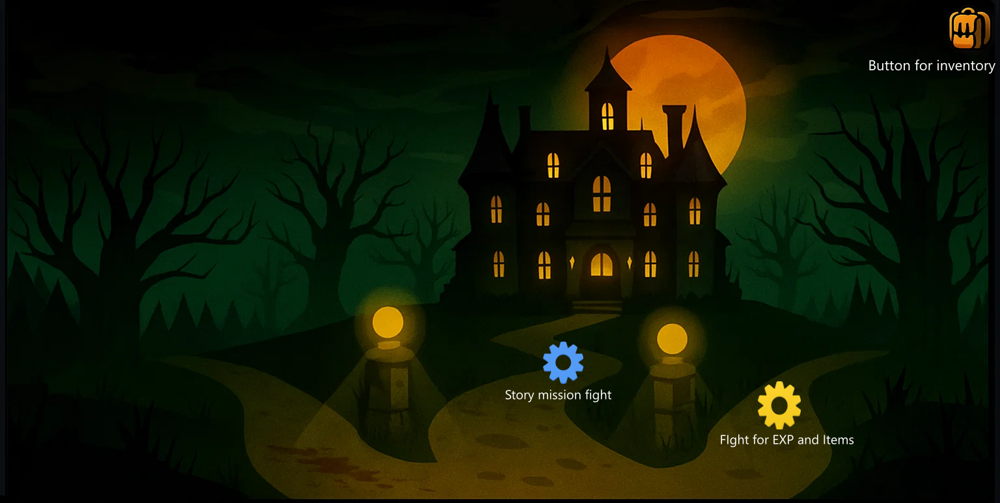
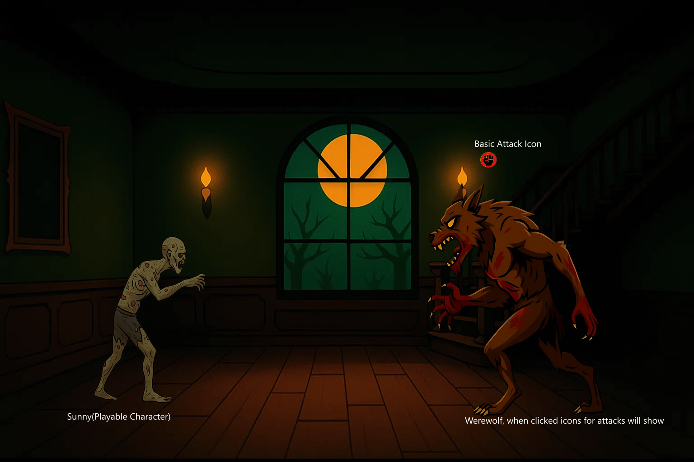

# Sunny
Inspired by the flash game Sonny, the deliverables would be a demo that has the core systems that would be in the full game. The demo should contain combat, main hub, items, inventory management, leveling / skills, enemies. 

### Combat
The combat will be turn-based, one playable character, 2~3 possible enemies, click on an enemy to see your equipped skills and click on the icon to use it. Click on yourself for healing spells/using items/defend.

### Main Hub 
The main hub will consist of a place to enter a shop (Blue Circle in Sonny’s UI, will not be in my demo due to time restraints) an area to fight enemies to gain XP or items (Yellow) and a place to select the next story fight which as it sounds progresses the plot. The demo will most likely only have one story fight due to the time restraints.

### Items
For the items I’m planning on making these into a database and when you win a fight it will query the DB for an item. An item could be a new weapon or a set of new armor. There will likely be 6 types of armor head, shoulders, torso, hands, legs, feet.

### Inventory Management
My inventory will probably look very similar to Sonny2 without the middle panel.  Drag and Drop items from inventory to equipment slot.

### Leveling / Skills
 The demo will probably have 3 skills with animations and effects but as mentioned above 

### UML

### Renders 
### Main Hub

### Story Fight

